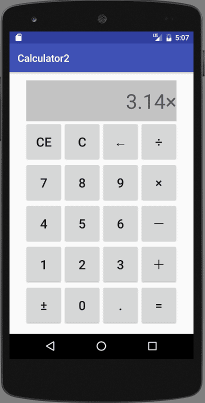
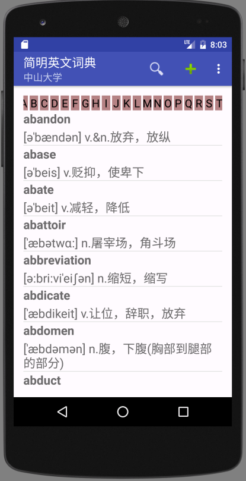
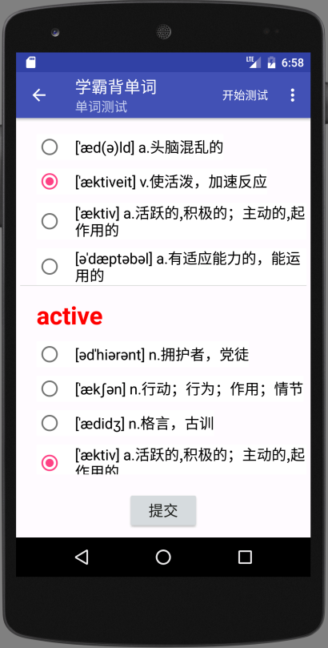
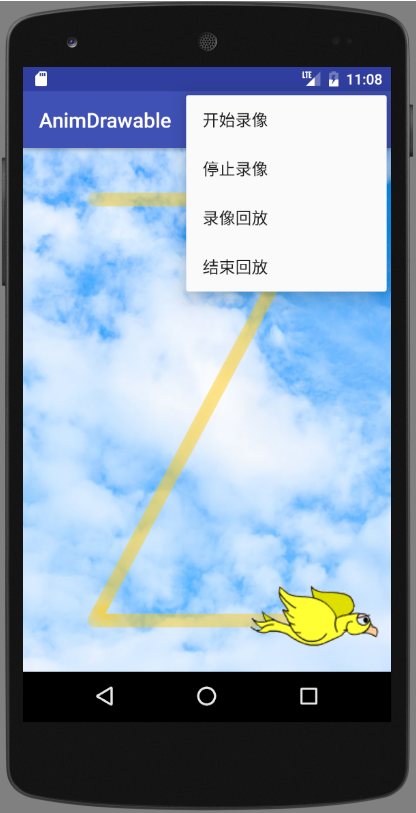

# Android
- Android Studio 2.2.2   
- Java version "1.8.0_241"   
- AVD: Nexus5_API_24  
  
注：01开头的项目文件夹下因为代码量不大，只保留了修改过的代码文件和图片资源，description.txt具体说明文件的路径  

[Work01_1 注册界面(Register)](https://github.com/kuangzj1998/Android/tree/master/01_1_Register)   
   
- 基本控件的使用 
- RelativeLayout  

[Work01_4 计算器(Calculator2)](https://github.com/kuangzj1998/Android/tree/master/01_4_Calculator2)   
   
- Java基础(String,Double...) 
- LinearLayout  

[Work01_5 二级目录(ExpandableListView)](https://github.com/kuangzj1998/Android/tree/master/01_5_ExpandableListView2)   
   
- 设置多个.xml 

[Work01_6 卡片布局(CardView)](https://github.com/kuangzj1998/Android/tree/master/CardView)   
   
- 引入Android Support Library v7的CardView 

[Work02_1 词典程序(GrandDictionary)](https://github.com/kuangzj1998/Android/tree/master/GrandDicitionary)   
   
- ActionBar,HorizontalScrollView,PopupMenu,ProgressDialog
- AlertDialog,Handler,Bundle
- JSON,SQLite,ContentProvider

[Work02_2 背单词(GrandWordRemember)](https://github.com/kuangzj1998/Android/tree/master/GrandWordRemember)   
   
- Activity,ContentResolver

[Work03 动画(AnimDrawable)](https://github.com/kuangzj1998/Android/tree/master/AnimDrawable)   
   
- Animation,Shape
- Canvas,Path
